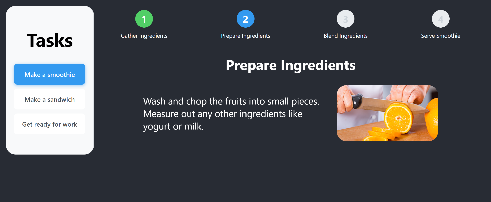

# Task Stepper Project

This project allows a user to step through instructions for a given task. As a user clicks through each step, their progress is displayed and saved.

All tasks and their associated steps are stored within a JSON file (tasks.json).

## Instructions

Within the task-stepper-project files, complete all code marked with: /* TODO

## Concepts

This project involves the following concepts:
- Pass props from parent to child components
- Create state variables and handle state changes
- Store data in browser localstorage

## Demo

See task-stepper-demo files for an example of a completed implementation.

